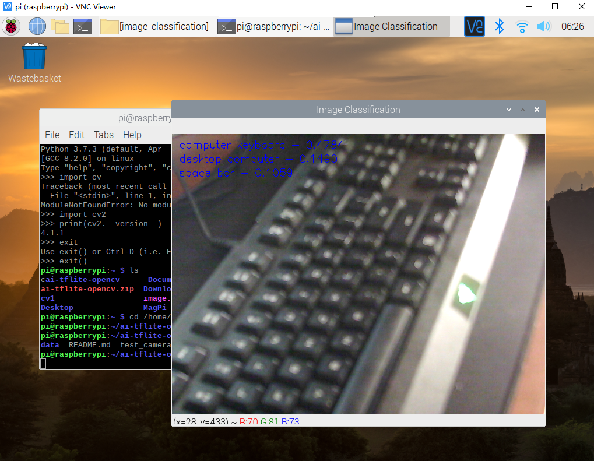

# ai-tflite-opencv
This repo contains codes that use Tensorflow (or Tensorflow Lite) + OpenCV to do object detection, classification, and Pose detection.

## Pre-requisite

- Installed Tensorflow (or Tensorflow Lite)
- Installed OpenCV
- Has camera (Optional)

## Download the Models

The .tflite models are not included, you will need to download the models before you run the code.

## Test Platform

The codes are tested successfully in below platform.

- ### Windows 10 / Ubuntu 18.04

Tensorflow 2.1 + OpenCV 4.2

- ### Raspberry PI 4 (4G Ram) - Raspbian Buster

Tensorflow Lite 2.1 + OpenCV 4.1

## Example Run

Image Classification with camera running on Raspberry PI 4:

